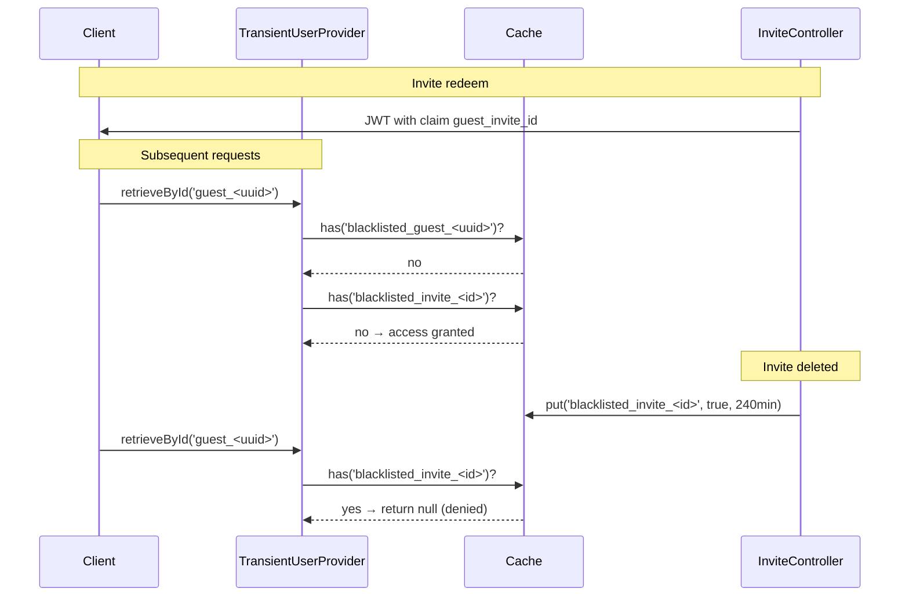

# Guest JWT Blacklist

## Problem

Guest JWT tokens (issued via `InviteController::redeem()`) could not be revoked after an invite was deleted. The JWT default TTL is 240 minutes (4 hours), leaving a significant window where a deleted invite's guest could still access galleries.

## Solution: Cache-based Invite-ID Blacklist

Instead of a separate DB table, we leverage the existing Cache-based blacklist infrastructure already present in `TransientUserProvider`.

### Architecture

### Key Components

1. **`InviteController::redeem()`** (`backend/app/Http/Controllers/InviteController.php:130`)
   - Adds `guest_invite_id` claim to guest JWT payload, linking the token to the specific `GalleryInvite` record

2. **`InviteController::destroy()`** (`backend/app/Http/Controllers/InviteController.php:165`)
   - After deleting the `GalleryInvite`, writes `blacklisted_invite_<id>` to Cache with TTL matching `JWT_TTL`
   - This makes the TTL self-cleaning: no orphaned cache entries after token expiry

3. **`TransientUserProvider::retrieveById()`** (`backend/app/Auth/TransientUserProvider.php:24-28`)
   - After the existing per-token blacklist check (`blacklisted_guest_<uuid>`), also checks `blacklisted_invite_<id>`
   - If the invite is blacklisted, also adds a per-token blacklist entry (`blacklisted_guest_<uuid>`) as a "cache fast-path" for subsequent requests with the same token

### Cache TTL Strategy

| Cache Key Pattern | TTL | Rationale |
|---|---|---|
| `blacklisted_guest_<uuid>` | 240 min (default `JWT_TTL`) | Matches token lifetime; auto-cleaned |
| `blacklisted_invite_<id>` | 240 min (default `JWT_TTL`) | Matches token lifetime; auto-cleaned |

Both entries self-expire after `JWT_TTL` minutes, at which point the token would be expired anyway.

### Open Items

- **Per-gallery granularity**: If a guest accumulated galleries from multiple invites, deleting one invite revokes ALL their access (the entire token is invalidated). For the current use case (single-invite guests), this is acceptable.
- **Real-user tokens**: Guests who later register and become real users retain their galleries via their real user token. The `TransientUserProvider` only applies to `guest_`-prefixed identifiers.
